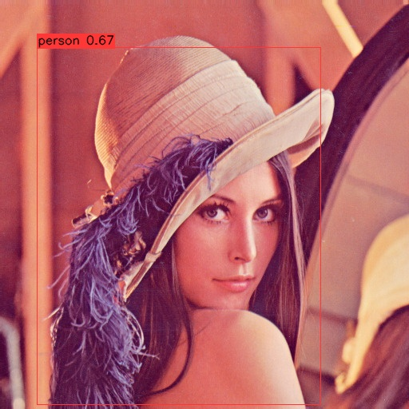

## yolox-onnx-cpp

[](https://github.com/yasaims/yolox-onnx-cpp/actions/workflows/ci.yml)

C++製 物体検出推論CLI (ONNX Runtime + OpenCV)



`tests/data/test.jpg` (Lenna) にYOLOX-Nanoを実行した結果。letterbox前処理 → 推論 → デコード →
NMS → 座標逆変換 → 描画、まで一気通貫のCLIで生成している (下記「実行」参照)。
動画入力にも対応しており、FPSオーバーレイ付きで結果を書き出せる (「動画入力」参照)。

<!-- TODO: 動画検出のデモGIFをここに追加する (動画素材を用意でき次第)。 -->

## 初期開発計画

開発中、プロジェクト方針を確認する場合には `.vscode/開発計画書.md`を参照する。
この計画書は更新せず、最新のコンテクストはCLAUDE.mdに記載すること。

## セットアップ (MSYS2 UCRT64)

依存パッケージ (OpenCV / ONNX Runtime / GoogleTest) を導入する:

```bash
pacman -S --needed mingw-w64-ucrt-x86_64-opencv mingw-w64-ucrt-x86_64-onnxruntime mingw-w64-ucrt-x86_64-gtest
```

いずれもCMake config (`find_package(... CONFIG)`) を同梱しているため、追加の設定は不要。

## モデル取得

```bash
python scripts/download_model.py            # models/yolox_nano.onnx を取得 (SHA256検証つき)
python scripts/download_model.py --model tiny
```

## ビルド

MSYS2 UCRT64シェル (またはPATHにucrt64/binを通した状態) で:

```bash
cmake --preset msys2-ucrt64-debug
cmake --build --preset msys2-ucrt64-debug
```

## 実行

```bash
./build/msys2-ucrt64-debug/src/yolox_onnx_cpp.exe \
  --model models/yolox_nano.onnx --input <画像 or 動画パス> \
  [--output result.jpg] [--size 416] [--score-thr 0.30] [--nms-thr 0.45] \
  [--labels labels.txt] [--format text|json] [--mode auto|image|video] \
  [--max-frames N] [--no-draw] [--verbose] [--help]
```

letterbox前処理 (アスペクト比維持 + 右下パディング) → 推論 → デコード (grid/stride適用) → NMS →
元画像スケールへの座標逆変換 → 描画、まで一気通貫で実行し、`--output` (既定 `output.jpg`、動画は
`output.mp4`) に検出結果を描画した画像/動画を書き出す。標準出力には検出件数と各検出のクラス・
スコア・座標・ラベル名を表示する:

```
detections=1
  class=0 score=0.671259 x=45.9994 y=59.1137 w=355.777 h=448.329 label=person
```

`--verbose` を付けると入出力テンソルの形状と生出力の先頭10要素も表示する(Phase 1からの継続)。
`--no-draw` を付けると描画・画像/動画の書き出しをスキップし、標準出力の結果だけを得る
(JSON出力をパイプで他ツールに渡す用途や、動画のベンチマークに使う)。

`--mode` は既定 `auto` で、`--input` の拡張子 (`.mp4` `.avi` `.mov` `.mkv` `.webm` `.m4v` を
動画とみなす) から画像/動画を自動判定する。明示的に `--mode image` / `--mode video` を指定して
上書きすることもできる。

### JSON出力

`--format json` を付けると、上記のテキスト出力の代わりに1行のJSONを出力する (自前実装、
外部ライブラリ非依存。理由は `docs/adr/0006-hand-rolled-json-output.md` 参照)。動画では
1フレーム1行のJSON Lines形式になる (全フレームをメモリに溜めずパイプで逐次処理できる):

```bash
./build/msys2-ucrt64-debug/src/yolox_onnx_cpp.exe \
  --model models/yolox_nano.onnx --input tests/data/test.jpg --format json --no-draw
```

```json
{
  "model": "models/yolox_nano.onnx",
  "input": "tests/data/test.jpg",
  "input_size": 416,
  "score_threshold": 0.3,
  "nms_threshold": 0.45,
  "image": { "width": 512, "height": 512 },
  "detections": [
    {
      "class_id": 0,
      "label": "person",
      "score": 0.671259,
      "box": { "x": 45.9994, "y": 59.1137, "w": 355.777, "h": 448.329 }
    }
  ]
}
```

### カスタムラベル (`--labels`)

既定ではCOCO 80クラス名を使うが、`--labels labels.txt` で1行1クラス名のテキストファイルを
指定すると、そのラベル名でテキスト/JSON出力・描画すべてが置き換わる。空行と `#` で始まる行は
無視される。この仕組みにより、プロジェクト④ (yolox-mini-platform) で独自クラスを学習・
ONNXエクスポートしたモデルも、本ツールでそのまま推論・可視化できる。

```
# labels.txt の例
widget
gadget
```

### 動画入力

`--input` に動画ファイルを渡すと (または `--mode video` を明示すると)、フレームごとに検出を
実行し、直近30フレームの移動平均で算出したFPSを画面左上にオーバーレイして `--output`
(既定 `output.mp4`、`mp4v` コーデック) へ書き出す。`cv::imshow` は使わずファイル書き出しのみ
行う (ヘッドレス環境・CIでも安全に動く設計)。`--max-frames N` で処理フレーム数を打ち切れる:

```bash
./build/msys2-ucrt64-debug/src/yolox_onnx_cpp.exe \
  --model models/yolox_nano.onnx --input demo.mp4 --output result.mp4 --max-frames 300
```

終了時に標準エラー出力へ総フレーム数・処理時間・平均FPSのサマリを表示する。

## テスト実行

GoogleTestによる単体テスト (letterbox・NMS・decode・CLI引数解析・ラベル読込・結果出力) を
ビルドと同じプリセットで実行する:

```bash
cmake --build --preset msys2-ucrt64-debug
ctest --test-dir build/msys2-ucrt64-debug --output-on-failure
```

## Linuxでのビルド (CIと同じ手順)

```bash
sudo apt-get install -y ninja-build libopencv-dev libgtest-dev

# ONNX Runtime公式プリビルトを取得 (MSYS2のようなCONFIGパッケージが無いため)
curl -sSL -o /tmp/onnxruntime.tgz \
  https://github.com/microsoft/onnxruntime/releases/download/v1.20.1/onnxruntime-linux-x64-1.20.1.tgz
mkdir -p /tmp/onnxruntime && tar -xzf /tmp/onnxruntime.tgz --strip-components=1 -C /tmp/onnxruntime

cmake --preset linux-gcc-release -DONNXRUNTIME_ROOT=/tmp/onnxruntime
cmake --build --preset linux-gcc-release
LD_LIBRARY_PATH=/tmp/onnxruntime/lib ctest --preset linux-gcc-release
```

`-DONNXRUNTIME_ROOT` を使うのは、ONNX Runtime公式プリビルトの `onnxruntimeConfig.cmake` が
`lib64/` を参照する既知のバグを `cmake/Findonnxruntime.cmake` の手動探索で回避するため
(`-DCMAKE_PREFIX_PATH` 経由のCONFIG探索だと踏んでしまう。CLAUDE.md「既知のハマりどころ」参照)。

`linux-clang-release` プリセットも同様 (clangをインストールした上で使う)。GitHub Actions
(`.github/workflows/ci.yml`) は gcc/clang 両方でこの手順を実行する。

## 数値一致検証 (Python参照実装とのparity)

letterbox前処理・grid/strideデコード・NMSの3箇所は、Python (numpy + ONNX Runtime) で
独立に再実装した参照実装との数値一致を `scripts/verify_parity.py` で検証できる
(BGR順序・座標系・grid順序が実装間でズレていないことの裏付け)。CIには含めない
ローカル開発ツール (`docs/adr/0005-test-strategy.md` 参照)。

```bash
python -m pip install -r scripts/requirements-dev.txt
cmake --build --preset msys2-ucrt64-debug   # yolox_onnx_cpp を先にビルドしておく
python scripts/verify_parity.py --verbose            # nano
python scripts/verify_parity.py --model tiny --verbose
```

`--size` は省略するとモデルの入力shapeから決まる。YOLOX 0.1.1rc0 の配布ONNXは
nano/tiny とも入力が `[1, 3, 416, 416]` に**固定**されており、`--size 640` のような
別サイズは指定しても推論できない (ONNX Runtimeが `InvalidArgument` を返す)。
そのため `--size` がモデル側と食い違う場合はスクリプトが実行前に理由付きで停止する。

別サイズを検証したい場合は、入力H/Wを動的軸にして再エクスポートしたモデルを
`--model <path>` にパスで渡す (`--model` は登録済みキーとパスの両方を受け付ける)。
グラフ自体は全層畳み込みなので、動的軸版では 640 (アンカー数8400) でも
nano/tiny 両方で座標・スコアが一致することを確認済み。

## 設計判断

C++バージョン、CPU Execution Provider採用理由、依存解決の方針、NMS自前実装、JSON出力自前実装の
意図などは [docs/adr/](docs/adr/) を参照。
