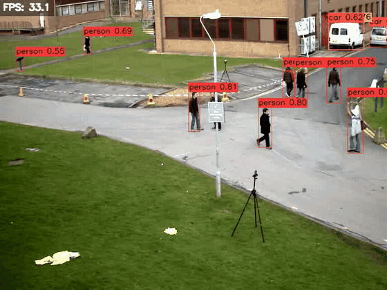

## yolox-onnx-cpp

[](https://github.com/yasaims/yolox-onnx-cpp/actions/workflows/ci.yml)

**CPUで高速に動作するC++製 物体検出推論CLI (ONNX Runtime + OpenCV)**



素材は OpenCV の `samples/data/vtest.avi`
([opencv/opencv](https://github.com/opencv/opencv), Apache License 2.0) の一部を切り出したもの。

## セットアップ (MSYS2 UCRT64)

依存パッケージ (OpenCV / ONNX Runtime / GoogleTest) を導入する:

```bash
pacman -S --needed mingw-w64-ucrt-x86_64-opencv mingw-w64-ucrt-x86_64-onnxruntime mingw-w64-ucrt-x86_64-gtest
```

## モデル取得

```bash
python scripts/download_model.py            # models/yolox_nano.onnx を取得 (SHA256検証つき)
python scripts/download_model.py --model tiny
```

## ビルド

MSYS2 UCRT64シェル (またはPATHにucrt64/binを通した状態) で:

```bash
cmake --preset msys2-ucrt64-debug
cmake --build --preset msys2-ucrt64-debug
```

## 実行

```bash
./build/msys2-ucrt64-debug/src/yolox_onnx_cpp.exe \
  --model models/yolox_nano.onnx --input <画像 or 動画パス> \
  [--output result.jpg] [--size 416] [--score-thr 0.30] [--nms-thr 0.45] \
  [--labels labels.txt] [--format text|json] [--mode auto|image|video] \
  [--max-frames N] [--no-draw] [--verbose] [--help]
```

- `--output` (既定 `output.jpg`、動画は`output.mp4`) に検出結果を描画した画像/動画を書き出す
- `--no-draw` 描画・画像/動画の書き出しをスキップし、標準出力の結果だけを得る
- `--labels` 1行1クラス名のテキストファイルを指定できる。既定ではCOCO 80クラス名を使用

## テスト実行

GoogleTestによる単体テスト

```bash
cmake --build --preset msys2-ucrt64-debug
ctest --test-dir build/msys2-ucrt64-debug --output-on-failure
```

## Linuxでのビルド

```bash
sudo apt-get install -y ninja-build libopencv-dev libgtest-dev

# ONNX Runtime公式プリビルトを取得 (MSYS2のようなCONFIGパッケージが無いため)
curl -sSL -o /tmp/onnxruntime.tgz \
  https://github.com/microsoft/onnxruntime/releases/download/v1.20.1/onnxruntime-linux-x64-1.20.1.tgz
mkdir -p /tmp/onnxruntime && tar -xzf /tmp/onnxruntime.tgz --strip-components=1 -C /tmp/onnxruntime

cmake --preset linux-gcc-release -DONNXRUNTIME_ROOT=/tmp/onnxruntime
cmake --build --preset linux-gcc-release
LD_LIBRARY_PATH=/tmp/onnxruntime/lib ctest --preset linux-gcc-release
```

`-DONNXRUNTIME_ROOT` を使うのは、ONNX Runtime公式プリビルトの `onnxruntimeConfig.cmake` が
`lib64/` を参照する既知のバグを `cmake/Findonnxruntime.cmake` の手動探索で回避するため

## 数値一致検証 (Python参照実装とのparity)

letterbox前処理・grid/strideデコード・NMSの3箇所は、Python (numpy + ONNX Runtime) で
独立に再実装した参照実装との数値一致を `scripts/verify_parity.py` で検証できる

```bash
python -m pip install -r scripts/requirements-dev.txt
cmake --build --preset msys2-ucrt64-debug   # yolox_onnx_cpp を先にビルドしておく
python scripts/verify_parity.py --verbose            # nano
python scripts/verify_parity.py --model tiny --verbose
```

## 設計判断

C++バージョン、CPU Execution Provider採用理由、依存解決の方針、NMS自前実装、JSON出力自前実装の意図などは [docs/adr/](docs/adr/) を参照。
